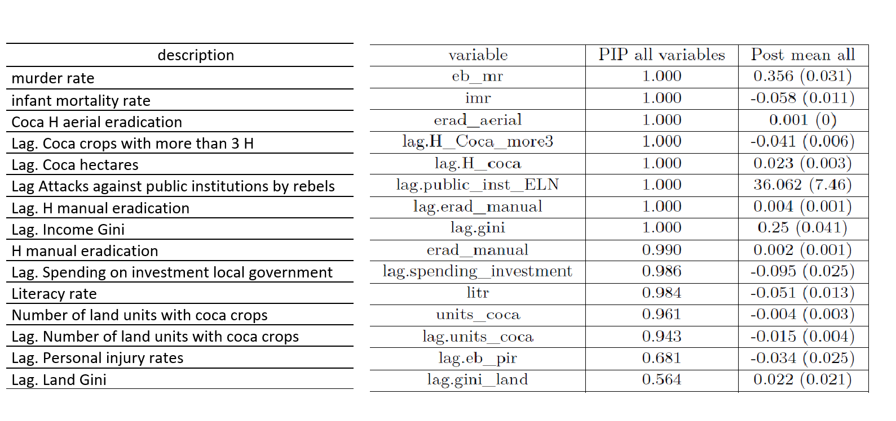

```{r setup, include=FALSE}
library(xaringan)
options(htmltools.dir.version = FALSE)
library(tidyverse)

```
# Colombian administrative levels 

.pull-left[ ## States and Municipalities


]

.pull-right[ ## Natural Regions


]


---
# Large regional disparities in Colombia

.pull-left[

### Well-being


]

.pull-right[
### Crime

**(In Germany = about 0.1 per 10.000 people,
In Japan = about 0.02 per 10.000 people)**
]

---
class: center
# Structure of the Dissertation


---
# Chapter 1:  Exploration and convergence

**Methods: Classical beta convergence**

$$(1 / T) \cdot \log \frac{y_{i T}}{y_{i 0}}=\alpha-\left[1-e^{-\beta T}\right] \cdot \log \left(y_{i 0}\right)+w_{i, 0 T}$$

**The spatial lag model:**
$$\log \frac{y_{i T}}{y_{i 0}}=\alpha+\beta \cdot \log \left(y_{i 0}\right)+\rho W \cdot \log \frac{y_{i T}}{y_{i 0}}+\epsilon_{t}$$
**The Spatial error model:**
$$\log \frac{y_{i T}}{y_{i 0}}=\alpha+\beta \cdot \log \left(y_{i 0}\right)+\lambda W \epsilon_{t}+u_{t}$$
**Global Spatial Autocorrelation: Global Moran's I**
$$I_{t}=\frac{N}{\sum_{i=1}^{n} \sum_{j=1}^{n} w_{i j}}\left[\frac{\sum_{i=1}^{n} \sum_{j=1}^{n} w_{i j}\left(X_{i}-\bar{X}\right)\left(X_{j}-\bar{X}\right)}{\sum_{i=1}^{n}\left(X_{i}-\bar{X}\right)^{2}}\right]$$
---
class: center
# Chapter 1: Data and Results


.pull-left[
**Global trend**


]

.pull-right[
**Spatial autocorrelation trend**

]
---
class: center
# Spatial regression and OLS results 


---

# Chapter 2: Convergence and Forecasting
**Exponential smoothing methods**


$$\hat{y}_{T+1 \mid T}=\alpha y_{T}+\alpha(1-\alpha) y_{T-1}+\alpha(1-\alpha)^{2} y_{T-2}+\cdots$$

**ARIMA models**


$$y_{t}^{\prime}=c+\phi_{1} y_{t-1}^{\prime}+\cdots+\phi_{p} y_{t-p}^{\prime}+\theta_{1} \varepsilon_{t-1}+\cdots \theta_{q} \varepsilon_{t-q}+\varepsilon_{t}$$

**Space time Autoregressive models (STAR)**

$$y_{i t}=\sum_{k=1}^{p} \sum_{l=0}^{\lambda_{k}} \phi_{k l} \sum_{j=1}^{N} w_{i j}^{(l)} y_{j t-k}+a_{i t}$$

**Proposed models: Beta convergence -> Forecasting  **
$$\log \left(\hat{y}_{i(t+4) \mid t}\right)=\hat{\alpha}_{t+4 \mid t}+\hat{\beta}_{t+4 \mid t} \cdot \log \left(y_{i t}\right)+w_{i, t}$$
$$\log \left(\hat{y}_{i(t+4) \mid t}\right)=\hat{\alpha}_{t+4 \mid t}+\hat{\beta}_{t+4 \mid t} \cdot \log \left(y_{i t}\right)+\hat{\theta}_{t+4 \mid t} W \cdot \log \left(y_{i t}\right)+\epsilon_{i, t}$$
---
# Cross validating forecasting models 
##How can the best forecasting model be chosen?

$$\begin{aligned}
&\text { Mean absolute error: } \operatorname{MAE}=\operatorname{mean}\left(\left|e_{t}\right|\right)\\
&\text { Root mean squared error: RMSE }=\sqrt{\operatorname{mean}\left(e_{t}^{2}\right)}
\end{aligned}$$
## Cross-validation of forecasts


---
class: center, middle
# Results (Beta and spatial Beta)


---
class: center
# Spatial distribution of forecasted crime
**municipalities in dark green are lagging behind**


---
class: center
# Spatial distribution of forecasted crime
**municipalities in dark green are lagging behind**


---
class: center
# Chapter 3: BMA - crime determinants
 212 variables (original and spatially lagged). **some significant determinants of homicides are** 


---
class:  center
# Significant determinants of homicides: 

## After running 2 million regressions...


---
class: center
# Chapter 4: Synthetic control - CCT

## Synthetic control methods: visual intuition
### In terms of GDP per capita


$$TOKYO=0.4*OSAKA + 0.2*AICHI+0.1∗FUKUOKA+...$$
### In terms of crime

The weights are found so that the synthetic municipality has a similar crime trend compared to the treatment region (2003-2011) and similar determinants from the BMA chapter.

---
class: center
# Results: Pacific region


---
class:  center
# The effect on crime of CCTS
.pull-left[

**Crime gaps for treatment municipalities and low CCT coverage placebos**


]

.pull-right[
**Overall effects = the gap in 2018 / Root mean sqaured predicted error**


]

## A t-test shows that the mean effect is statistically lower for the treatment group.
---
class: center
# In just 15 minutes:


---

class: center
# Thanks!

** Thank you very much for your attention**


 

**Quantitative Regional and Computational Science Lab**

https://quarcs-lab.org/


